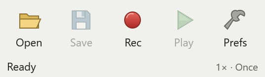

# MiniTask

A small Windows app that records your mouse and keyboard actions so you can play them back whenever you need them.



## Download and setup

1. [Download MiniTask for Windows](https://github.com/mwlyra/MiniTask/releases/download/v1.1.2/MiniTask-1.1.2-win-x64.zip).
2. Right-click the ZIP file and choose **Extract All**.
3. Open the extracted folder and run **MiniTask.exe**.

Requires **Windows 11, 64-bit**. There is no installer, account, or separate .NET download. MiniTask runs locally and works offline.

Updating? Close the old copy first, including its tray icon, then extract the new download. Your saved recordings and preferences carry over.

## Make your first recording

1. Open the app you want to automate.
2. Press **F8** to start recording, then perform your actions.
3. Press **F8** again to finish.
4. Return the target app to the same starting position and press **F9** to play the recording.

Press **F10** whenever you need to stop. You can also use the **Rec**, **Play**, and **Stop** buttons on the toolbar.

Keep windows in the same position for playback and leave the mouse and keyboard alone while it runs. Try a short recording first. On some laptops, function keys require holding **Fn**.

## Controls

| Action | Shortcut |
| --- | --- |
| Start / stop recording | F8 |
| Start / stop playback | F9 |
| Emergency stop | F10 |
| Open a recording | Ctrl+O |
| Save a recording | Ctrl+S |

**Save** keeps a recording as a `.minitask` file. **Open** loads one without starting playback.

Use **Prefs** to change playback speed, repeat count, start delay, shortcuts, or appearance. Choose **Continuous playback** to repeat until stopped. **Always on top** keeps the toolbar within reach.

## Need help?

- **MiniTask is already running:** look for its icon in the system tray and double-click it.
- **A shortcut is unavailable:** another app may be using it. Choose a different key under **Prefs → Hotkeys**.
- **Playback clicks the wrong place:** restore the original window positions, monitor layout, and display scaling.
- **An app ignores playback:** some apps block simulated input. See the [compatibility guide](docs/COMPATIBILITY.md).

Recordings can include everything you type, so avoid recording passwords or other private information. The download is unsigned, and Windows may show a publisher warning.

For more options, see the [user guide](docs/USER-GUIDE.md). To report a problem, [open an issue](https://github.com/mwlyra/MiniTask/issues) with your Windows version and the steps to reproduce it. Avoid attaching recordings containing private information.

## Build from source

Install the **.NET 10 SDK** on Windows, clone this repository, and run the following commands from its folder:

```powershell
dotnet restore MiniTask.slnx
dotnet build MiniTask.slnx -c Release --no-restore
dotnet run --project src/MiniTask.Desktop -c Release --no-build
```

To create a portable executable:

```powershell
dotnet publish src/MiniTask.Desktop -c Release -r win-x64 --self-contained true -p:PublishSingleFile=true -o artifacts/portable
```

Developer documentation: [architecture](docs/ARCHITECTURE.md), [file format](docs/MACRO-FORMAT.md), [testing](docs/TESTING.md), and [packaging](docs/PACKAGING.md).
