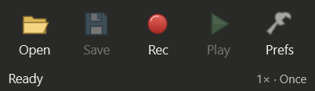

# MiniTask 1.1.2


A compact, offline Windows macro recorder built with C#, .NET 10 LTS, WPF and Win32. Original source and branding; no TinyTask code or assets.



**Launch `MiniTask.exe` → Rec → perform actions → Stop → Play.** Defaults: **F8** record, **F9** play, **F10** emergency stop. Change them under **Prefs → Hotkeys**. Opening a macro never plays it.

Version 1.1 has a classic **284 × 117** utility window: Open, Save, Rec, Play and Prefs. The title and slim status line show recording time, playback progress and Stop. Speed, repeat count and shortcuts are menu choices; captions can be hidden for a smaller toolbar. Existing macro files and preferences are preserved.

## Download / run

Download the Windows ZIP from [GitHub releases](https://github.com/mwlyra/MiniTask/releases), extract `MiniTask-1.1.2-win-x64.zip`, and run `MiniTask.exe`. **Exit an older running MiniTask first, including its tray icon.** No installer, account, administrator rights, network connection or separately installed runtime is required. The executable is unsigned. Keep the included documentation nearby.

Version 1.1.2 gives MiniTask a classic cassette recorder icon, using the toolbar's muted colors, dark outlines and small beveled highlights. Editable SVG and PNG [branding assets](https://github.com/mwlyra/MiniTask/tree/main/assets/brand) are included in the source.

The shortcut menu offers F1–F11; F12 is shown as reserved by Windows. Keys assigned to another action are labeled and disabled. Existing F13–F24 assignments are preserved, but these specialist keys are no longer offered in the menu.

The source and a portable build are delivered. **This is a release candidate, not a fully desktop-certified production release.** Automated engine and WPF checks pass, but physical end-to-end recording in external apps and the full live-injection suite remain unverified in this environment. See [test results](docs/TEST-RESULTS.md) before relying on unattended playback.

## Build

Use Windows x64 and the .NET 10 SDK. The SDK used for this delivery is **10.0.401**, runtime **10.0.12**. Run from this folder:

```powershell
dotnet restore MiniTask.slnx --configfile NuGet.Config
dotnet build MiniTask.slnx -c Release --no-restore
dotnet run --project tests/MiniTask.Core.Tests -c Release --no-build
dotnet run --project src/MiniTask.Desktop -c Release --no-build
```

Alternatively, `./build.ps1` builds and runs core tests. `./build.ps1 -Publish` also produces `artifacts/portable/MiniTask.exe` and `artifacts/MiniTask-win-x64.zip`. The first publish downloads Microsoft's Windows runtime packs. An SDK installed outside PATH can be passed with `-DotNet 'C:\path\dotnet.exe'`.

```powershell
dotnet publish src/MiniTask.Desktop -c Release -r win-x64 --self-contained true -p:PublishSingleFile=true --configfile NuGet.Config -o artifacts/portable
```

For desktop checks, close any running MiniTask instance, use an interactive foreground terminal and run `./build.ps1 -WindowsChecks`. It opens test windows and may briefly move the mouse and type into its test window. Leave the keyboard and mouse alone during that run. Tests return a nonzero exit code if the required desktop is unavailable. The standalone input-test window is available through **Prefs → Tools → Input-test window**, or `MiniTask.exe --input-test`.

## Structure

| Component | Responsibility |
| --- | --- |
| `src/MiniTask.Core` | Event model, bounded recording queue, monotonic playback scheduler, state gate, file validation and atomic saves; no WPF/Win32 dependency |
| `src/MiniTask.Windows` | Dedicated hook/message thread, hotkeys, session/display notifications, physical-input tracking, SendInput and target resolution |
| `src/MiniTask.Desktop` | WPF toolbar, settings, themes, tray, recent files, input-test window, single instance and elevation restart |
| `tests/MiniTask.Core.Tests` | Deterministic clock/input-sink checks and measured real cancellation |
| `tests/MiniTask.Windows.Tests` | Windows structure/registration/capture-pipeline tests plus guarded live injection checks |
| `tests/MiniTask.Ui.Tests` | Actual WPF construction, accessibility names and rendered layout checks |

There are no third-party runtime dependencies. Windows Forms is used only for the native tray icon/menu. WPF trimming is disabled. The self-contained runtime accounts for most distribution size; see [packaging measurements](docs/PACKAGING.md).

Read the [user guide](docs/USER-GUIDE.md), [macro format](docs/MACRO-FORMAT.md), [compatibility page](docs/COMPATIBILITY.md) and [engineering notes](docs/ARCHITECTURE.md).
